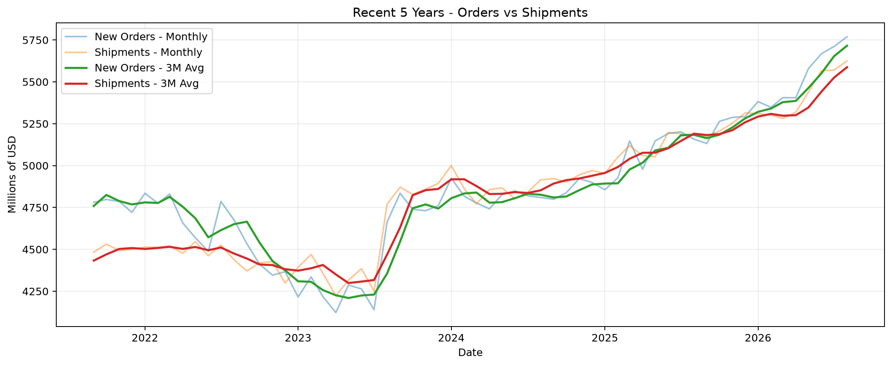
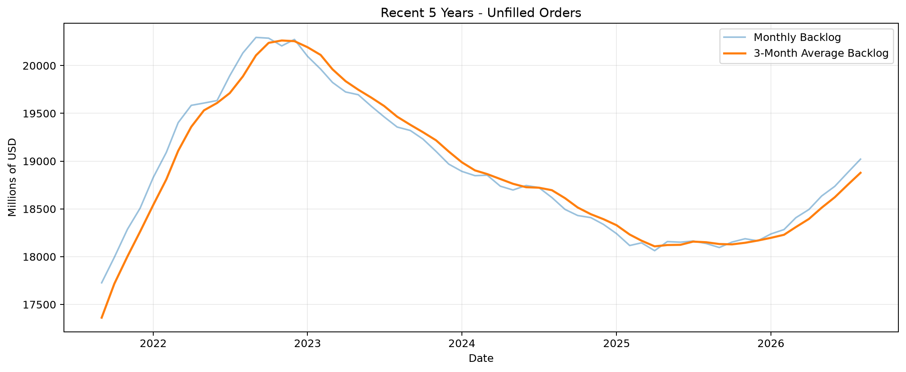
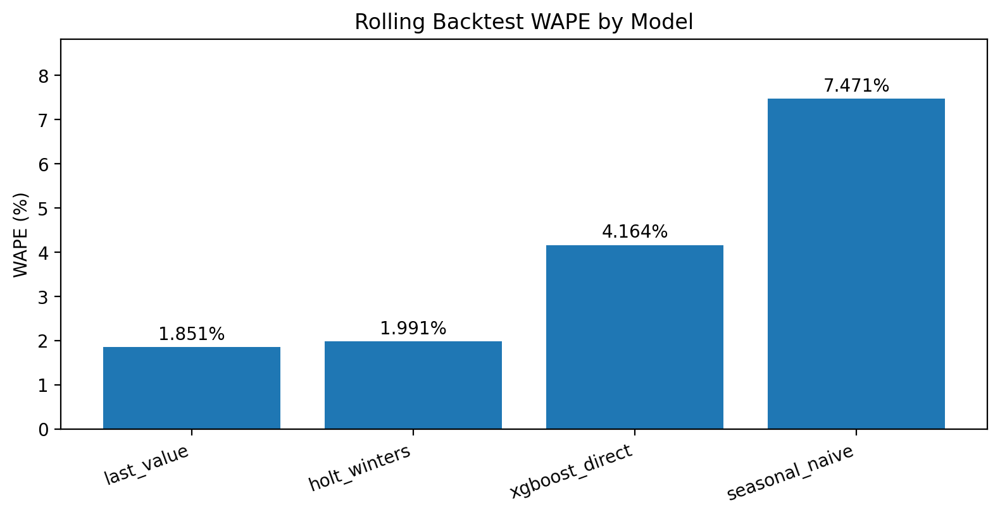
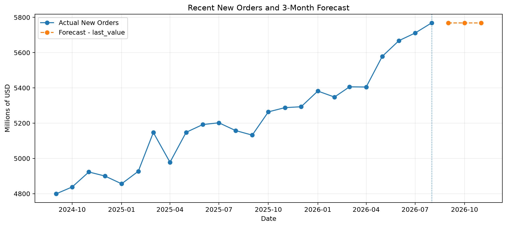
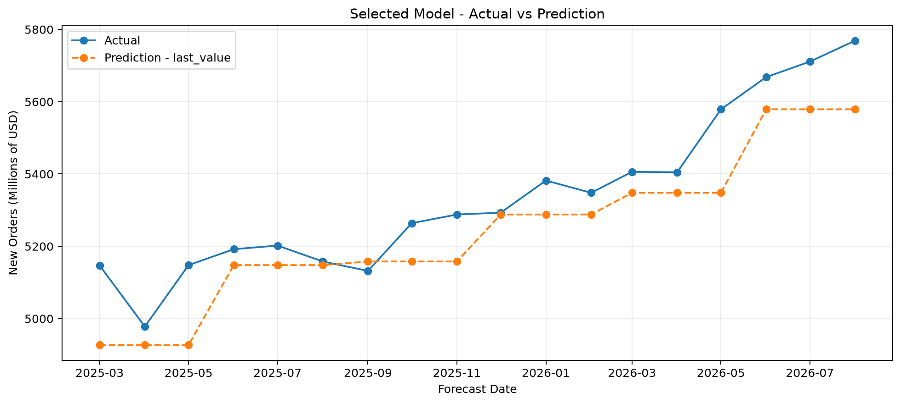
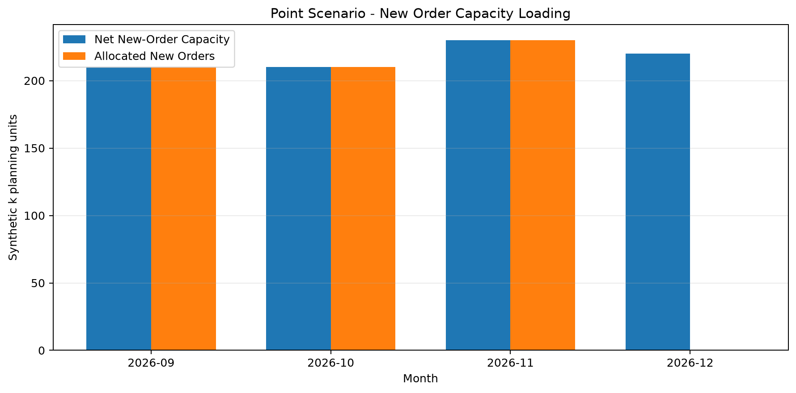
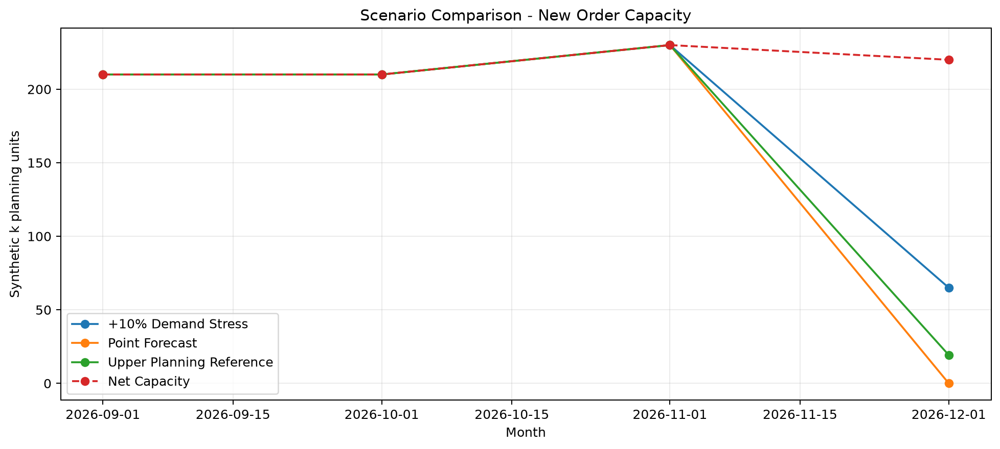

# 電子零組件生產規劃與交期風險分析

這個專案用公開的電子元件製造業資料，從「需求、出貨、未交訂單」一路做到「需求預估、產能情境、訂單交期風險」。

我想回答的不是只有「下個月需求是多少」，而是更接近生產規劃會遇到的問題：

- 最近需求有沒有比出貨跑得快？
- 手上的未交訂單算多還是少？
- 需求預估如果稍微低估，會不會影響交期？
- 哪些訂單最容易先出現風險？
- 如果需求增加，產能與承諾月份要怎麼調整？

線上展示：

https://electronic-components-planning.onrender.com/

---

## 專案流程

```text
公開製造業資料
    ↓
資料驗證
    ↓
需求與出貨分析
    ↓
未交訂單分析
    ↓
未來 3 個月需求預估
    ↓
檢查預估誤差與低估傾向
    ↓
建立需求上修情境
    ↓
放入模擬產能與客戶訂單
    ↓
判斷哪些訂單能按期、哪些要先注意、哪些會延後
```

這個流程分成 6 本 Notebook：

| Notebook | 內容 |
|---|---|
| `01_data_validation.ipynb` | 檢查資料來源、缺值、重複月份與時間範圍 |
| `02_demand_shipment_analysis.ipynb` | 比較新訂單與出貨量，觀察近期需求壓力 |
| `03_backlog_analysis.ipynb` | 分析未交訂單、變化幅度與相對出貨速度 |
| `04_order_forecasting.ipynb` | 比較 4 種方法，建立未來 3 個月需求預估 |
| `05_forecast_evaluation.ipynb` | 檢查預估誤差、低估傾向與需求上修參考 |
| `06_order_fulfillment_simulator.ipynb` | 把需求情境放進模擬產能與訂單，估算交期風險 |

---

## 資料來源

專案使用美國電子元件製造業的公開月資料。

| 資料 | 系列代碼 | 來源 | 單位 |
|---|---|---|---|
| 新訂單 | `A34HNO` | U.S. Census Bureau M3 | 百萬美元 |
| 出貨量 | `A34HVS` | U.S. Census Bureau M3 | 百萬美元 |
| 未交訂單 | `A34HUO` | U.S. Census Bureau M3 | 百萬美元 |
| 總庫存 | `A34HTI` | U.S. Census Bureau M3 | 百萬美元 |
| 工業生產指數 | `IPG3344S` | Federal Reserve Board | 指數 |

整理後的月資料期間為：

```text
1992-02 ～ 2026-08
共 415 個月份
```

這些資料是產業層級的公開資料，不是任何單一公司的客戶、產能或交期資料。

---

# 1. 最近需求與出貨是什麼狀況？

截至 2026-08：

| 指標 | 結果 |
|---|---:|
| 新訂單 | 5,769 百萬美元 |
| 出貨量 | 5,625 百萬美元 |
| 當月訂單與出貨差額 | +144 百萬美元 |
| 最近 3 個月訂單／出貨比 | 1.023 |
| 最近 12 個月訂單／出貨比 | 1.014 |

### 「最近 3 個月訂單／出貨比 1.023」是什麼意思？

計算概念是：

```text
最近 3 個月平均新訂單
÷
最近 3 個月平均出貨量
```

目前：

```text
5,716
÷
5,587.33
≈ 1.023
```

白話來說：

> 最近收到的新訂單速度，大約比出貨速度高 2.3%。

這不代表一定會缺產能，但代表近期進來的需求稍微快於消化速度，所以需要再搭配未交訂單一起看。



---

# 2. 未交訂單約可支撐 3.4 個月，代表什麼？

截至 2026-08：

| 指標 | 結果 |
|---|---:|
| 未交訂單 | 19,021 百萬美元 |
| 最近 1 個月增加 | +144 百萬美元 |
| 最近 3 個月增加 | +386 百萬美元 |
| 最近 12 個月增加 | +883 百萬美元 |
| 與去年同月相比 | +4.87% |
| 最近 12 個月中未交訂單增加的月份 | 10 個月 |
| 未交訂單相對出貨速度 | 3.40 個月 |

### 3.40 個月怎麼算？

這裡不是把未交訂單直接除以最新一個月的出貨量，而是使用最近 3 個月平均出貨量，避免單月波動太大。

公式：

```text
未交訂單
÷
最近 3 個月平均出貨量
```

實際數字：

```text
19,021
÷
5,587.33
≈ 3.40 個月
```

白話來說：

> 假設從現在開始完全沒有新訂單進來，而且每個月都維持最近差不多的出貨速度，目前累積還沒有完成的訂單，大約相當於 3.4 個月的出貨量。

這個數字可以幫助判斷「手上的未交訂單，相對目前出貨速度到底算多還是少」。

但它 **不是客戶交期**。

因為公開資料沒有：

- 每張訂單的產品別
- 製程路徑
- 在製品狀態
- 各機台產能
- 客戶優先順序
- 真實承諾日期

所以 3.40 個月只能當成產業層級的未交訂單規模指標。



### 目前應該怎麼解讀？

未交訂單最近確實在增加：

```text
3 個月 +386 百萬美元
12 個月 +883 百萬美元
年增 +4.87%
```

但是未交訂單相對出貨速度的 Coverage，最近 3 個月反而下降約：

```text
-0.08 個月
```

因此比較合理的解讀不是「情況全面惡化」，而是：

> 未交訂單的金額正在增加，但近期出貨速度也同步變快，所以未交訂單相對出貨能力的壓力並沒有一起惡化。

---

# 3. 未來 3 個月需求怎麼預估？

我沒有直接挑最複雜的模型，而是讓 4 種方法使用相同的時間序列回測方式比較。

比較的方法：

| 方法 | WAPE |
|---|---:|
| Last Value | **1.851%** |
| Holt-Winters | 1.991% |
| XGBoost Direct | 4.164% |
| Seasonal Naive | 7.471% |

### WAPE 1.851% 是什麼意思？

WAPE 是用來看整體預估和實際值差多少。

這裡的結果表示：

> 在這次歷史回測裡，Last Value 的整體預估誤差大約是實際需求總量的 1.85%。

數字越低代表整體誤差越小。

因此目前選擇：

```text
Last Value
```

作為基準需求預估。



### 為什麼簡單方法反而最好？

Last Value 的邏輯很直接：

> 下一期先用目前最新的需求水準當作預估。

在這組近期資料裡，這個簡單方法的回測誤差最低。

這也提醒我：

> 模型不是越複雜越好，應該用同一套回測方式看哪一個方法真的比較準。

---

# 4. 未來 3 個月預估結果

選出的基準預估結果：

| 月份 | 預估新訂單 |
|---|---:|
| 2026-09 | 5,769 百萬美元 |
| 2026-10 | 5,769 百萬美元 |
| 2026-11 | 5,769 百萬美元 |



這不是代表未來三個月一定都會剛好是 5,769。

它只代表：

> 依目前的回測結果，使用最新需求水準當作短期基準，是目前四種方法裡誤差最低的做法。

因此後面還需要繼續檢查：

- 這個方法通常是估高還是估低？
- 誤差可能有多大？
- 如果需求真的比預估高，交期會不會開始受到影響？

---

# 5. 模型雖然誤差小，但有一個重要問題：很常估得太低

我再檢查 Last Value 的 18 筆歷史驗證結果。

結果：

| 指標 | 結果 |
|---|---:|
| 驗證筆數 | 18 |
| 低估次數 | **17** |
| 高估次數 | 1 |
| 整體偏差 | **-1.80%** |
| 單月最大絕對誤差 | 4.29% |

也就是：

> 18 次預估裡，有 17 次的預估值比實際需求低。

雖然整體 WAPE 只有 1.851%，但它有明顯的「低估方向」。

白話來說：

> 這個方法平常差得不算多，可是近期需求往上走時，它常常會慢半拍。

所以如果只拿基準預估直接做產能與交期承諾，可能會稍微太樂觀。



---

# 6. 為什麼另外做「需求多約 3%」的情境？

18 筆歷史回測的絕對百分比誤差如下：

| 指標 | 誤差 |
|---|---:|
| 中位數 | 1.35% |
| 75th percentile | 2.42% |
| 80th percentile | **2.96%** |
| 90th percentile | 4.18% |
| 最大值 | 4.29% |

我使用歷史回測誤差的 80th percentile：

```text
2.96%
```

建立一個較保守的需求參考。

基準預估：

```text
5,769
```

上方需求參考：

```text
5,769 × 1.0296
≈ 5,939.73
```

所以 Dashboard 裡的：

```text
需求多約 3%
```

不是隨便挑一個數字，而是來自目前回測中觀察到的歷史誤差尺度。

### 這個 2.96% 不能怎麼解讀？

它不能解讀成：

```text
未來有 80% 機率一定落在這個範圍裡
```

因為目前只有 18 筆 out-of-sample 驗證資料，而且誤差分布還有明顯低估方向。

因此這裡比較適合把它當成：

> 一個簡單、透明的需求上修情境，拿來檢查如果實際需求比基準高一些，排程會發生什麼變化。

---

# 7. 怎麼把需求預估接到產能與訂單？

前面的需求預估使用公開產業資料，單位是：

```text
百萬美元
```

但真正的公司產能、客戶訂單、優先順序與交期都不是公開資料。

因此 `06_order_fulfillment_simulator.ipynb` 另外建立一組 **模擬生產規劃資料**。

模擬的內容包含：

- 月產能
- 原本已排工作的產能
- 安全保留
- 新訂單可用產能
- 客戶訂單
- 訂單數量
- 優先順序
- 客戶要求月份

### 模擬產能

| 月份 | 總產能 | 原本已排 | 安全保留 | 可排新訂單 |
|---|---:|---:|---:|---:|
| 2026-09 | 600 | 360 | 30 | **210** |
| 2026-10 | 620 | 380 | 30 | **210** |
| 2026-11 | 610 | 350 | 30 | **230** |
| 2026-12 | 630 | 380 | 30 | **220** |

例如 2026-09：

```text
總產能 600
- 原本已排工作 360
- 安全保留 30
= 可排新訂單 210
```

白話來說：

> 不是看到總產能 600 就代表 600 都可以拿來接新單。原本排好的工作和刻意保留的安全空間都要先扣掉，真正能排新訂單的只有 210。

---

# 8. 訂單怎麼排？

模擬訂單共有 6 張：

| 訂單 | 客戶 | 原始數量 | 要求月份 | 優先順序 |
|---|---|---:|---|---|
| O001 | Customer_A | 120 | 2026-09 | High |
| O002 | Customer_B | 60 | 2026-09 | Normal |
| O003 | Customer_C | 130 | 2026-10 | High |
| O004 | Customer_D | 100 | 2026-10 | Normal |
| O005 | Customer_E | 150 | 2026-11 | High |
| O006 | Customer_F | 90 | 2026-11 | Normal |

排序邏輯：

```text
先看要求月份
→ 同一個月份再看優先順序
→ 依剩餘產能往前排
```

目前模擬沒有訂單 release date，所以允許訂單提早生產。

---

# 9. 目前需求下，為什麼有 2 張訂單要先注意？

基準情境總需求量：

```text
650
```

結果：

| 狀態 | 訂單數 |
|---|---:|
| 按期 | 4 |
| 先注意 | **2** |
| 延後 | 0 |
| 排不進去 | 0 |

需要先注意的是：

```text
O004
O006
```

### O004 為什麼要注意？

O004 要求 2026-10 完成。

它目前仍然可以在 10 月排完，所以還沒有延後。

但是排完後，該月份的新訂單可用空間只剩：

```text
約 4.8%
```

所以它被標成：

```text
先注意
```

### O006 為什麼要注意？

O006 要求 2026-11 完成。

目前可以在 11 月排完，但是排完後可用新訂單空間剛好剩：

```text
0%
```

也就是說：

> 目前看起來可以準時，但幾乎沒有任何緩衝。

只要需求增加、臨時插單、設備異常或重工，就可能往下一個月移。

這也是 Dashboard 不只顯示「有沒有延後」，還會另外標出「先注意」的原因。



---

# 10. 如果需求只多約 3%，結果會怎麼變？

把需求量乘上：

```text
1.0296
```

總需求從：

```text
650
```

增加到約：

```text
669.24
```

結果變成：

| 狀態 | 訂單數 |
|---|---:|
| 按期 | 4 |
| 先注意 | 0 |
| 延後 | **2** |
| 排不進去 | 0 |

延後的仍然是：

```text
O004
O006
```

真正跨過原要求月份的數量合計：

```text
21.37
```

這裡最重要的不是「多了 2.96%」本身，而是：

> 原本已經很接近產能邊界的 O004、O006，在需求只增加約 3% 後，就開始跨月。

這表示這兩張訂單的交期比較敏感，正式承諾前應該優先確認：

- 需求有沒有再變動
- 有沒有其他臨時訂單
- 是否能調整產能
- 是否可以拆批完成
- 是否要重新確認可承諾月份

---

# 11. 如果需求增加 10%，結果會怎麼變？

壓力測試把需求放大到：

```text
715
```

結果：

| 狀態 | 訂單數 |
|---|---:|
| 按期 | 3 |
| 先注意 | 1 |
| 延後 | **2** |
| 排不進去 | 0 |
| 延後數量 | **96** |

其中：

- O002：先注意
- O004：延後
- O006：延後

雖然延後訂單仍然是 2 張，但延後數量從：

```text
21.37
```

增加到：

```text
96
```

所以只看「有幾張 Late」還不夠。

還需要一起看：

> 到底有多少數量真的跨過原交期。



---

# 12. 三個情境放在一起看

| 情境 | 總需求 | 按期 | 先注意 | 延後 | 延後數量 |
|---|---:|---:|---:|---:|---:|
| 目前需求 | 650.00 | 4 | 2 | 0 | 0.00 |
| 需求多約 3% | 669.24 | 4 | 0 | 2 | 21.37 |
| 需求多 10% | 715.00 | 3 | 1 | 2 | 96.00 |

這張表想表達的是：

> 基準需求下看起來排得完，不代表交期完全沒有風險。

O004 與 O006 在基準情境已經接近產能上限，因此只要需求稍微增加，就會先受到影響。

---

# 13. Dashboard 做什麼？

Streamlit Dashboard 把上面的分析整理成比較容易操作的畫面。

可以切換三種需求情境：

```text
目前需求
需求多約 3%
需求多 10%
```

切換後會重新計算：

- 總需求
- 按期訂單
- 需要先注意的訂單
- 延後訂單
- 延後數量
- 每個月產能使用情況
- 訂單可完成月份

Dashboard 也會把需要處理的訂單先拉出來，而不是一開始就顯示整張完整表格。

---

# 14. 狀態定義

### 按期

訂單可以在原要求月份以前或當月完成，而且排完後仍有足夠空間。

### 先注意

訂單目前還可以按期完成，但排完後該月份剩下的新訂單空間低於 10%。

這代表：

> 還沒有延後，但緩衝很少。

### 延後

只要訂單有一部分數量排到原要求月份之後，整張訂單就標示為延後。

### 延後數量

只計算真正排到原要求月份之後的那部分數量。

因此：

```text
延後訂單數
```

和：

```text
延後數量
```

代表的事情不同。

---

# 15. 專案最重要的發現

這個專案最後得到的不是「某個模型最好」這麼簡單。

真正比較重要的是以下幾件事：

1. 最近新訂單速度略高於出貨速度，3 個月訂單／出貨比為 **1.023**。
2. 未交訂單增加到 **19,021 百萬美元**，比去年同月高 **4.87%**。
3. 但未交訂單相對近期出貨速度約為 **3.40 個月**，而且比 3 個月前下降 **0.08 個月**，所以壓力訊號不是全面惡化。
4. Last Value 在四種方法中回測誤差最低，WAPE 為 **1.851%**。
5. 但 18 次驗證中有 **17 次低估需求**，整體 Bias 為 **-1.80%**。
6. 使用歷史誤差建立約 **+2.96%** 的需求上修情境後，O004、O006 從「先注意」變成「延後」。
7. 需求增加 10% 時，延後訂單仍是 2 張，但延後數量增加到 **96**。

因此這個專案的核心不是預測一個單一數字，而是：

> 把需求預估的不確定性接到產能與訂單排程，提早找出最容易受到影響的訂單。

---

# 16. 重要限制

這個專案刻意把「真實公開資料」與「模擬規劃資料」分開。

### 真實公開資料

用於：

- 新訂單
- 出貨量
- 未交訂單
- 庫存
- 工業生產
- 需求預估
- 預估誤差分析

### 模擬資料

用於：

- 月產能
- 原本已排工作
- 安全保留
- 客戶訂單
- 訂單數量
- 優先順序
- 要求月份

因此 Dashboard **不代表任何公司的真實訂單、真實產能或真實客戶交期**。

另外還有幾個限制：

- 公開需求預估單位是百萬美元。
- 模擬產能與訂單使用的是規劃單位。
- 兩者沒有真實換算關係，只使用需求的相對百分比變化建立情境。
- 未交訂單 Coverage 不是客戶 Lead Time。
- `+2.96%` 是歷史回測誤差尺度，不是未來需求機率。
- 訂單只到月份，沒有精確日期。
- 模擬沒有 order release date，因此允許提早生產。
- 沒有加入實際製程 routing、WIP、設備停機、良率、重工與產品組合限制。

---

# 17. 專案結構

```text
electronic-components-planning/
├── app/
│   └── app.py
├── assets/
│   ├── model_wape.png
│   ├── horizon_error_bias.png
│   ├── scenario_capacity_loading.png
│   └── scenario_sensitivity.png
├── data/
│   ├── raw/
│   ├── processed/
│   ├── final_3_month_order_forecast.csv
│   ├── forecast_evaluation_summary.csv
│   ├── forecast_planning_reference.csv
│   ├── synthetic_capacity_plan.csv
│   ├── synthetic_order_book.csv
│   └── ...
├── notebooks/
│   ├── 01_data_validation.ipynb
│   ├── 02_demand_shipment_analysis.ipynb
│   ├── 03_backlog_analysis.ipynb
│   ├── 04_order_forecasting.ipynb
│   ├── 05_forecast_evaluation.ipynb
│   └── 06_order_fulfillment_simulator.ipynb
├── reports/
│   ├── figures/
│   └── tables/
├── requirements.txt
├── render.yaml
└── README.md
```

---

# 18. 使用工具

分析部分：

```text
Python
pandas
NumPy
Matplotlib
statsmodels
XGBoost
scikit-learn
Jupyter Notebook
```

Dashboard：

```text
Streamlit
Plotly
pandas
NumPy
```

部署：

```text
GitHub
Render
```

---

# 19. 本機啟動 Dashboard

建立虛擬環境：

```powershell
python -m venv .venv
```

Windows PowerShell 啟用：

```powershell
.\.venv\Scripts\Activate.ps1
```

安裝 Dashboard 套件：

```powershell
pip install -r requirements.txt
```

啟動：

```powershell
streamlit run app/app.py
```

瀏覽器開啟：

```text
http://localhost:8501
```

---

# 20. Render 部署

Build Command：

```text
pip install -r requirements.txt
```

Start Command：

```text
streamlit run app/app.py --server.port $PORT --server.address 0.0.0.0
```

---

## 最後結論

這個專案從公開產業資料開始，先確認需求、出貨與未交訂單的狀態，再建立短期需求預估。

結果顯示目前選出的預估方法整體誤差不大，但有明顯低估需求的傾向。

因此我沒有只停在「預測數字」，而是再建立需求上修情境，搭配模擬的產能與訂單資料，觀察哪些訂單會最先受到影響。

最後可以看到：

> 在目前需求下，O004、O006 還能按期，但已經沒有太多安全空間；需求只增加約 3%，兩張訂單就開始跨月。

這也是這個專案最想呈現的概念：

> **需求預估的價值，不只是猜一個未來數字，而是讓生產規劃可以更早看到產能與交期風險。**
